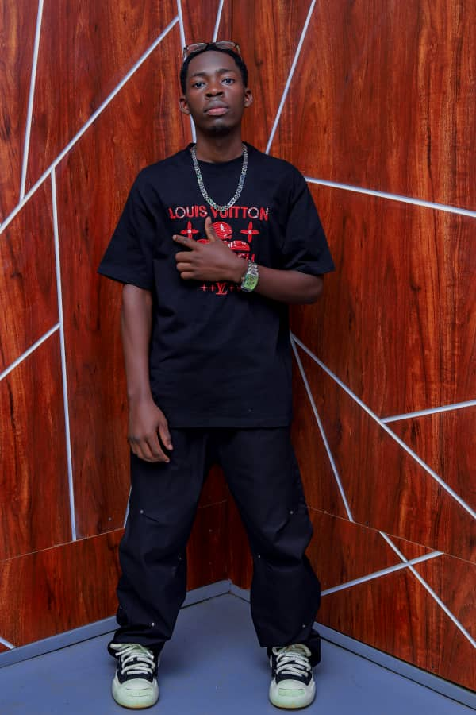
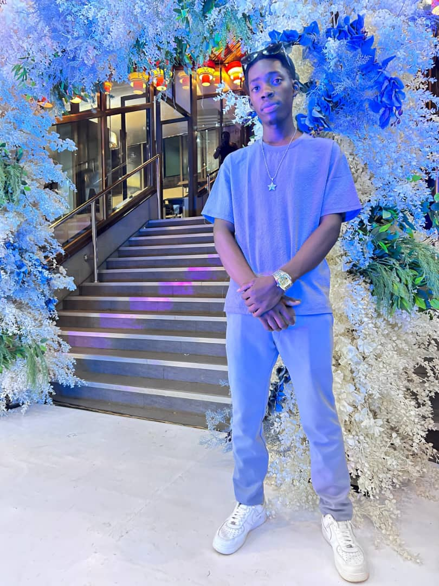
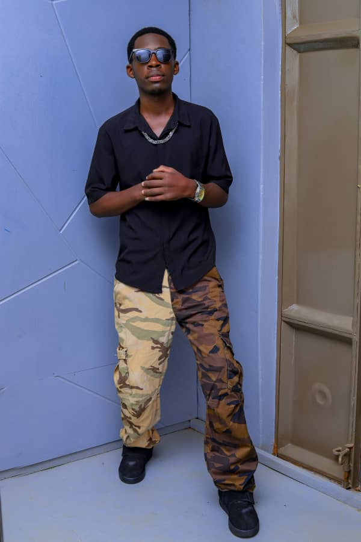

<!DOCTYPE html>
<html lang="en">
<head>
    <meta charset="UTF-8">
    <meta name="viewport" content="width=device-width, initial-scale=1.0">
    <title>YO BOY LEMONADE</title>
    <link rel="icon" type="image/png" href="image/13.png">
    <link href="https://fonts.googleapis.com/css2?family=Bebas+Neue&family=Roboto&display=swap" rel="stylesheet">
    
</head>
<body>

<header>
    

        <h1>YO BOY LEMONADE</h1>
        <nav>
            <ul>
                <li><a href="#home">Home</a></li>
                <li><a href="#portfolio">Portfolio</a></li>
                <li><a href="#about">About</a></li>
                <li><a href="#contact">Contact</a></li>
            </ul>
        </nav>
    

</header>

<section id="home" class="hero">
    <h2>Feel the Beat, Live the Music</h2>
    
Professional music artist  bringing rhythm, melody, and soul together.
	

    <a href="#portfolio" class="button">Listen Now</a>
</section>

<section id="portfolio">
    <h2>Portfolio</h2>
    

        

            
            <h3>CINDERELLA by LEMONADE</h3>
            <audio controls>
                <source src="music/CINDERELLA by LEMONADE.mp3" type="audio/mpeg">
            </audio>
        

        

            
            <h3>SORRY LEMONADE mrlemonade2564</h3>
            <audio controls>
                <source src="music/SORRY LEMONADE mrlemonade2564.mp3" type="audio/mpeg">
            </audio>
        

	
	
	
	

        

            
            <h3>ONDI WALA by YO BOY LEMONADE</h3>
            <audio controls>
                <source src="music/ONDI WALA by YO BOY LEMONADE.mp3" type="audio/mpeg">
            </audio>
        

        

            
            <h3>WEDDING DAY</h3>
            <audio controls>
                <source src="music/WEDDING DAY.mp3" type="audio/mpeg">
            </audio>
        
	
		
    

</section>

<section id="about">
    

        <h2>About Me</h2>
        

            
            
Hi, I'm <strong>Yo Boy Lemonade</strong>, a passionate music artist with a love for music that make people move. 
            With over 5 years in the industry, I specialize EDM, working with artists to 
            create unforgettable soundscapes.Music is the drug that makes me high

        

    

</section>

<section id="contact">
    <h2>Contact Me</h2>
    <form action="mailto:youremail@example.com" method="post" enctype="text/plain">
        <input type="text" name="name" placeholder="Your Name" required>
        <input type="email" name="email" placeholder="Your Email" required>
        <textarea name="message" rows="5" placeholder="Your Message" required></textarea>
        <button type="submit">Send</button>
    </form>
</section>

<footer>
    
&copy; 2025 YO BOY LEMONADE. All rights reserved.

</footer>

</body>
</html>
